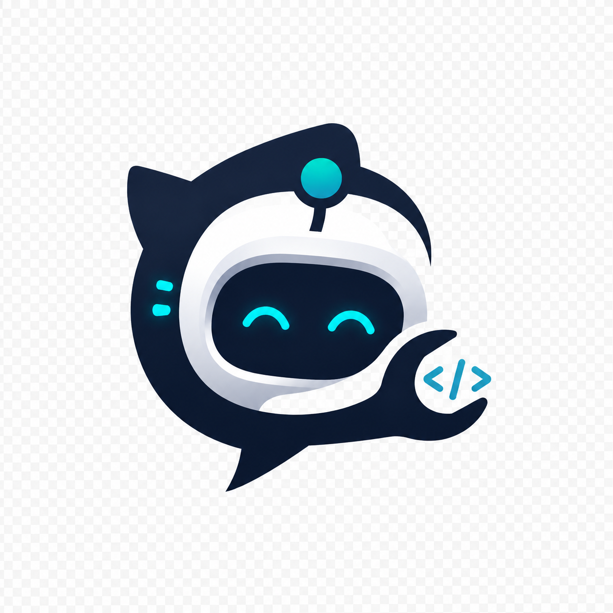

#  LatentTwin

> **AI-Powered Architectural Dependency Graph & Autonomous Repair Engine**

LatentTwin transforms complex software repositories into interactive 2D & 3D architecture maps, automatically detects system bugs using LLMs, and provides single-click AI code fixes.

---

## ✨ Features

- **🌐 Interactive 2D & 3D Graphing**: Dynamic architecture visualization powered by ReactFlow & Three.js.
- **🌊 Particle Wave Overlay**: Google Stitch-inspired particle wave animation for all loading & scanning states.
- **🤖 Autonomous AI Diagnostics**: Deep repository bug scanning & tier classification powered by Gemini LLM.
- **🛠️ 1-Click AI Code Repair**: Targeted code patch synthesis directly from detected bug lines & stack traces.
- **⚡ Rate & Size Limits**: Built-in 50MB repo size checks and 24h AI repair rate limiting.

---

## 📁 Project Structure

- **`client/`**: React + Vite frontend with Tailwind CSS, ReactFlow & Three.js 3D visualizer.
- **`repo-analysis-service/`**: Fastify microservice for GitHub repo fetching, AST graph parsing & Gemini diagnostics.
- **`server/`**: Execution runner & automated patch verification engine.
- **`demo-system/`**: Multi-service microservice ecosystem for offline demonstration.

---

## 🚀 Quick Start

### 1. Install Dependencies
```bash
# Install frontend & service dependencies
cd client && npm install
cd ../repo-analysis-service && npm install
```

### 2. Environment Setup
Add your Gemini API key in `repo-analysis-service/.env`:
```env
PORT=3001
GEMINI_API_KEY=your_gemini_api_key
```

### 3. Run LatentTwin
```bash
# Terminal 1: Backend Analysis Microservice
cd repo-analysis-service && npm run dev

# Terminal 2: Frontend Dashboard
cd client && npm run dev
```
